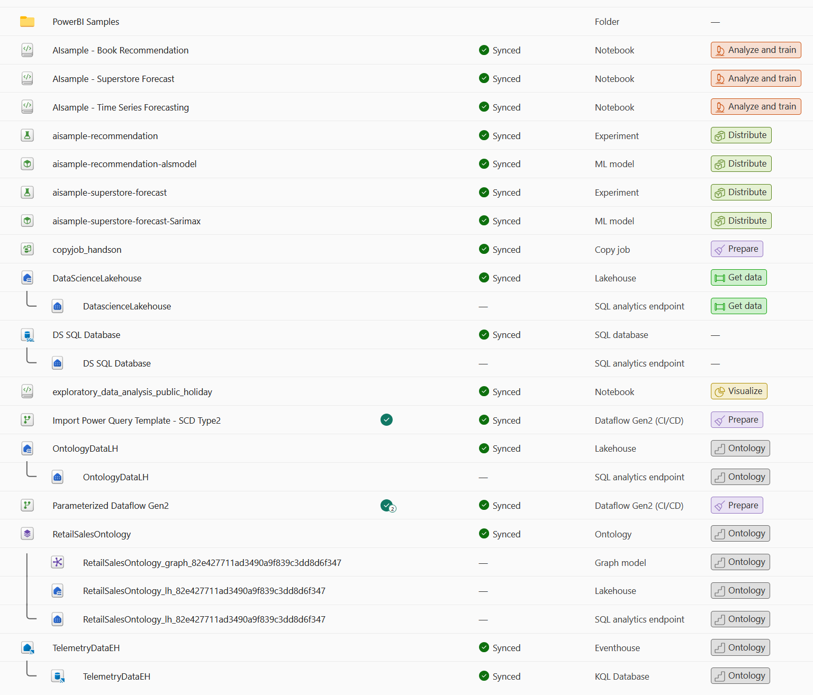
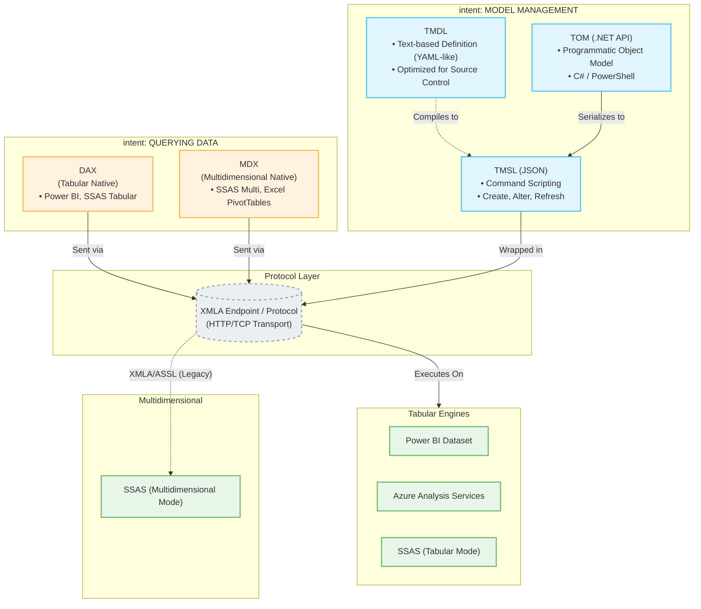

# Microsoft Fabric metadata created by Hands-On

Sample project demonstrating Microsoft Fabric capabilities. Import this repository using the [Github Integration](https://learn.microsoft.com/en-us/fabric/cicd/git-integration/intro-to-git-integration) feature to load the data into your workspace.

## Contents

- **AI/ML**: Book recommendation, sales forecasting, time series analysis, exploratory data analysis
- **ML Models**: ALS recommendation, SARIMAX forecasting
- **Data Engineering**: Copy jobs, SCD Type 2 dataflows, parameterized dataflows
- **Data Storage**: Lakehouses, SQL Database, Eventhouse
- **Ontology**: Retail sales ontology with entity/relationship types
- **Power BI**: Sample reports and semantic models




- Configuration - Modify metadata for your endpoint
`RetailSalesOntology.Ontology\EntityTypes\197236223423507\DataBindings\355669f1-bf4f-459a-a90b-1dfd2fe0ca45.json`

## Resources

- [Power BI Desktop Samples](https://github.com/microsoft/powerbi-desktop-samples)
    - [Training workshops for Power BI](https://github.com/microsoft/pbiworkshops)
    - [DAX Queries](https://aka.ms/dax-queries)
- [Fabric Samples](https://github.com/microsoft/fabric-samples)
    - [Use end-to-end AI samples in Microsoft Fabric](https://learn.microsoft.com/en-us/fabric/data-science/use-ai-samples)
    - [Slowly changing dimension type 2](https://learn.microsoft.com/en-us/fabric/data-factory/slowly-changing-dimension-type-two)
    - [Parameterized Dataflow Gen2](https://learn.microsoft.com/en-us/fabric/data-factory/dataflow-gen2-parameterized-dataflow)
    - [IQ Samples](https://github.com/microsoft/fabric-samples/tree/main/docs-samples/iq)
    - [Fabric IQ: Ontology Tutorial](https://learn.microsoft.com/en-us/fabric/iq/ontology/tutorial-0-introduction)
    - Fabric IQ: Ontology query: Fabric uses **Cypher**, the graph-query language used by Neo4j, Memgraph, and other property-graph databases.
        ```cypher
        MATCH (node_Store:Store)-[edge1_has:has]->(node_SaleEvent:SaleEvent) RETURN TO_JSON_STRING(node_Store) AS Store, TO_JSON_STRING(edge1_has) AS edge_1_has, TO_JSON_STRING(node_SaleEvent) AS SaleEvent LIMIT 1000
        ```

## Power BI DSL

- Power BI: DAX, MDX  → XMLA | TOM / [TMDL (Tabular Model Definition Language)](https://learn.microsoft.com/en-us/analysis-services/tmdl/tmdl-overview) → TMSL → XMLA
