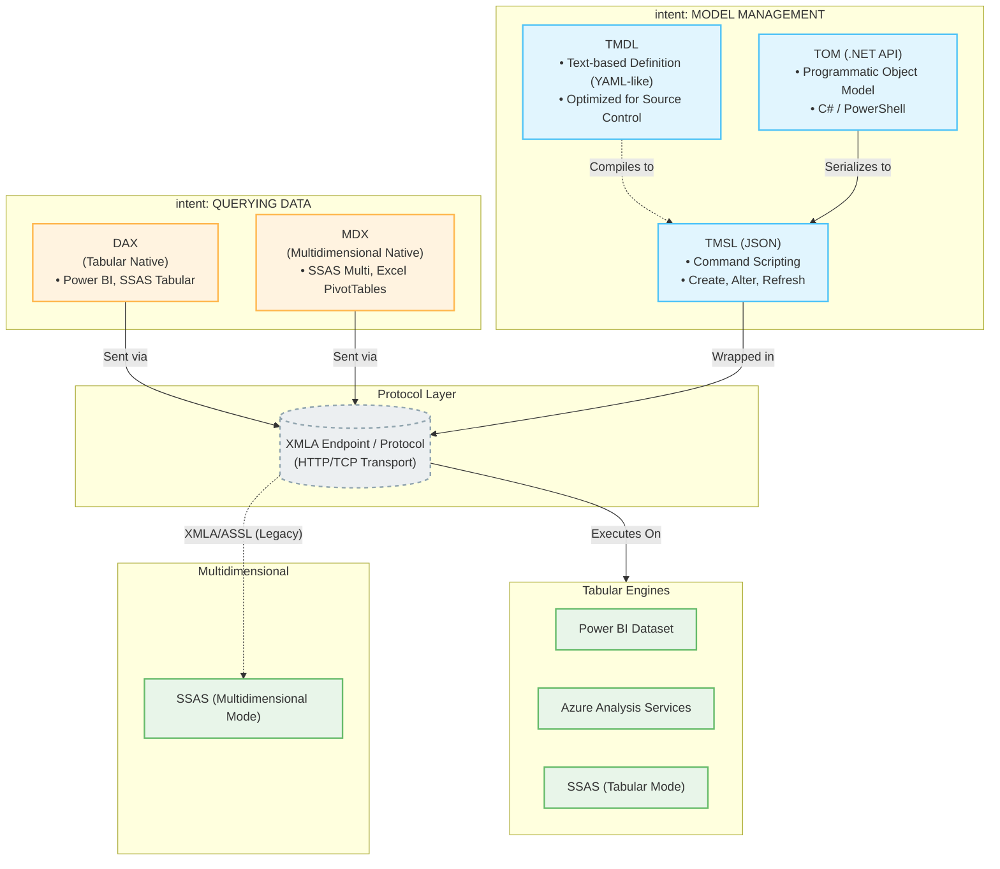

# Microsoft Fabric Hands-On

Sample project demonstrating Microsoft Fabric capabilities. Use the [Github Integration](https://learn.microsoft.com/en-us/fabric/cicd/git-integration/intro-to-git-integration) feature to import the data into your workspace.

## Contents

- **AI/ML**: Book recommendation, sales forecasting, time series analysis
- **ML Models**: ALS recommendation, SARIMAX forecasting
- **Data Engineering**: Copy jobs, SCD Type 2 dataflows, parameterized pipelines
- **Data**: Lakehouse, SQL Database
- **Power BI**: Sample reports

## Resources

- [Power BI Desktop Samples](https://github.com/microsoft/powerbi-desktop-samples)
    - [Training workshops for Power BI](https://github.com/microsoft/pbiworkshops)
    - [DAX Queries](https://aka.ms/dax-queries)
- [Fabric Samples](https://github.com/microsoft/fabric-samples)
    - [IQ Samples](https://github.com/microsoft/fabric-samples/tree/main/docs-samples/iq)
    - [Ontology Tutorial](https://learn.microsoft.com/en-us/fabric/iq/ontology/tutorial-0-introduction)
- Power BI: DAX, MDX  → XMLA | TOM / [TMDL (Tabular Model Definition Language)](https://learn.microsoft.com/en-us/analysis-services/tmdl/tmdl-overview) → TMSL → XMLA

```mermaid
flowchart TB

    %% ===================
    %% Styling
    %% ===================
    classDef query fill:#fff3e0,stroke:#ffb74d,stroke-width:2px
    classDef management fill:#e1f5fe,stroke:#4fc3f7,stroke-width:2px
    classDef protocol fill:#eceff1,stroke:#90a4ae,stroke-width:2px,stroke-dasharray: 5 5
    classDef engine fill:#e8f5e9,stroke:#66bb6a,stroke-width:2px

    %% ===================
    %% Intent: Querying Data
    %% ===================
    subgraph Querying[" intent: QUERYING DATA "]
        direction TB
        DAX["DAX<br/>(Tabular Native)<br/>• Power BI, SSAS Tabular"]
        MDX["MDX<br/>(Multidimensional Native)<br/>• SSAS Multi, Excel PivotTables"]
    end

    %% ===================
    %% Intent: Development & Management
    %% ===================
    subgraph DevOps[" intent: MODEL MANAGEMENT "]
        direction TB
        TMDL["TMDL<br/>• Text-based Definition (YAML-like)<br/>• Optimized for Source Control"]
        TOM["TOM (.NET API)<br/>• Programmatic Object Model<br/>• C# / PowerShell"]
        TMSL["TMSL (JSON)<br/>• Command Scripting<br/>• Create, Alter, Refresh"]
    end

    %% ===================
    %% The Transport Layer
    %% ===================
    subgraph Transport[" Protocol Layer "]
        XMLA_Endpoint[("XMLA Endpoint / Protocol<br/>(HTTP/TCP Transport)")]
    end

    %% ===================
    %% Targets
    %% ===================
    subgraph TabularEngines[" Tabular Engines "]
        PBI["Power BI Dataset"]
        AAS["Azure Analysis Services"]
        SSAS_T["SSAS (Tabular Mode)"]
    end

    subgraph MultiEngine[" Multidimensional "]
        SSAS_M["SSAS (Multidimensional Mode)"]
    end

    %% ===================
    %% Relationships
    %% ===================
    
    %% Query Flows
    DAX -->|"Sent via"| XMLA_Endpoint
    MDX -->|"Sent via"| XMLA_Endpoint

    %% Management Flows
    TMDL -.->|"Compiles to"| TMSL
    TOM -->|"Serializes to"| TMSL
    TMSL -->|"Wrapped in"| XMLA_Endpoint

    %% Execution Flows
    XMLA_Endpoint -->|"Executes On"| TabularEngines
    XMLA_Endpoint -.->|"XMLA/ASSL (Legacy)"| SSAS_M

    %% Styling Assignments
    class DAX,MDX query
    class TMDL,TOM,TMSL management
    class XMLA_Endpoint protocol
    class PBI,AAS,SSAS_T,SSAS_M engine
```